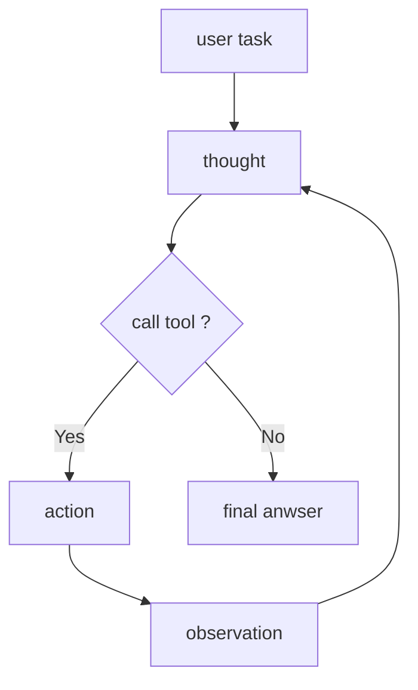
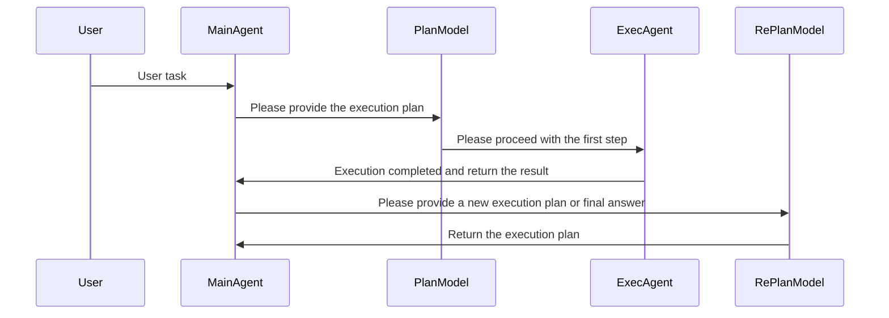

# mini-agent

## 设计模式

### Reflection

```mermaid
flowchart TB


```

### Tool use

### ReAct

```mermaid
flowchart TB
  input[user task] --> thought
  thought --> tool{call tool ?}
  tool --> |Yes|action
  action --> observation
  observation --> thought
  tool --> |No|output[final anwser]

```

### Plan and Execute

```mermaid
sequenceDiagram
  User ->> MainAgent: User task
  MainAgent ->> PlanModel: Please provide the execution plan
  PlanModel ->> ExecAgent: Please proceed with the first step
  ExecAgent ->> MainAgent: Execution completed and return the result
  MainAgent ->> RePlanModel: Please provide a new execution plan or final answer
  RePlanModel ->> MainAgent: Return the execution plan  

```

### Reason without Observation
