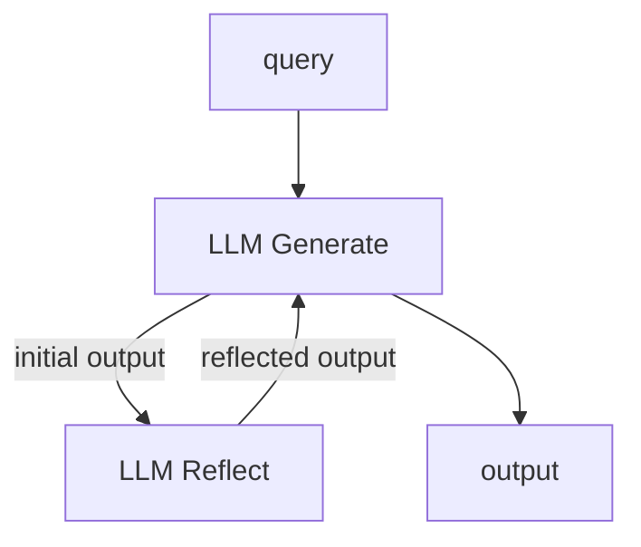
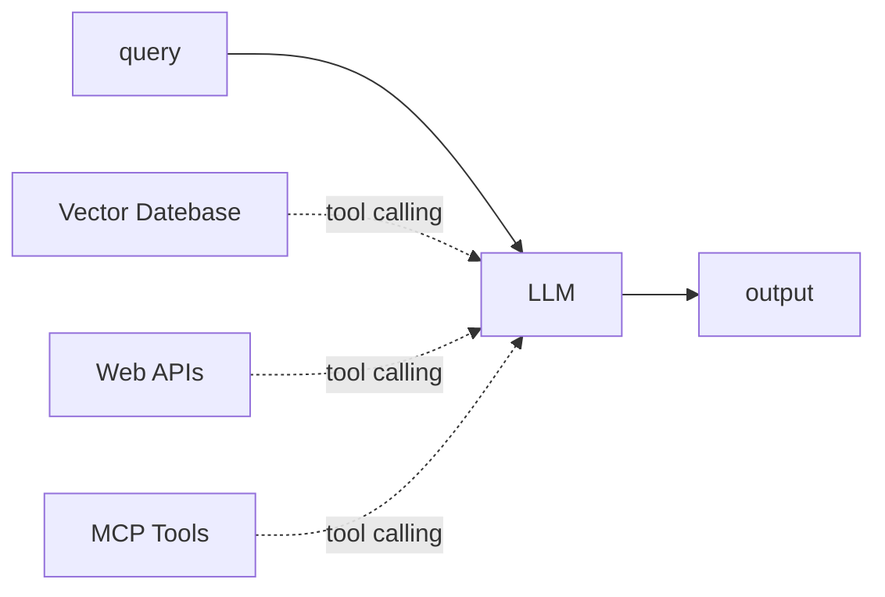
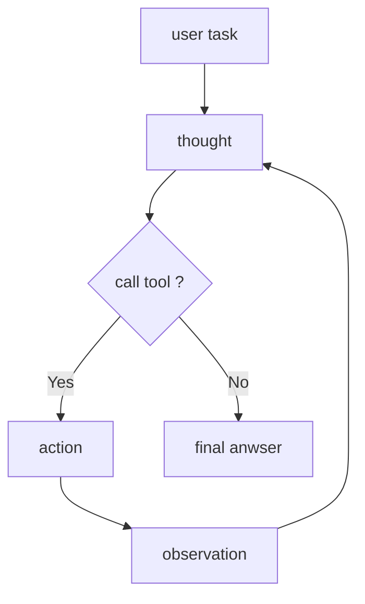
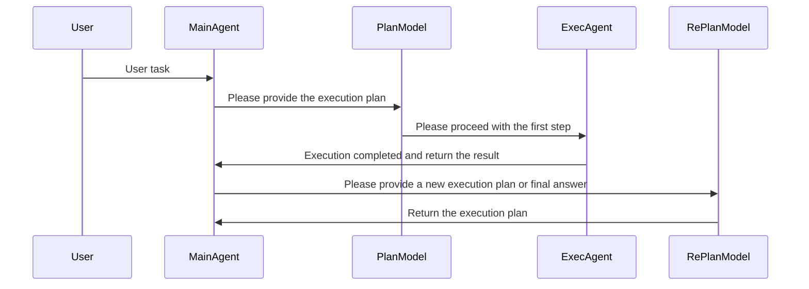
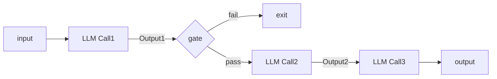
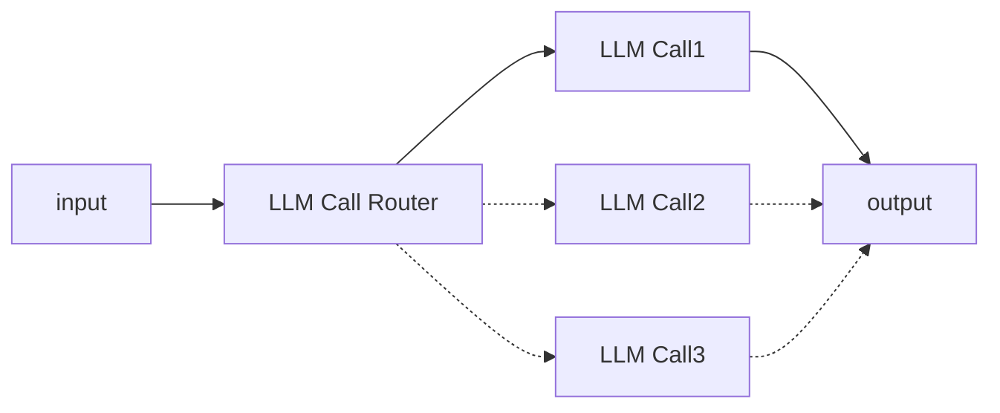
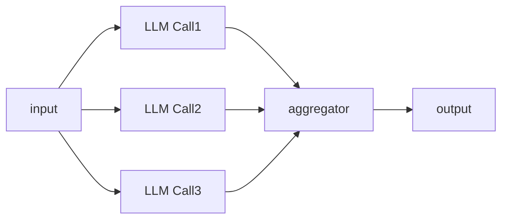
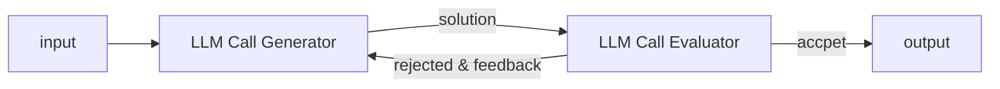
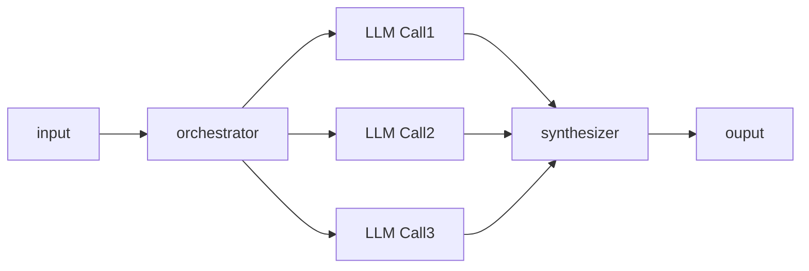

# mini-agent

## 设计模式

### Reflection

### Tool use

### ReAct

### Plan and Execute

### Multi Agent

### Reason without Observation

### Workflow

#### Prompt Chain

#### Routing

#### Parallelization

#### Evaluator-optimizer

#### Orchestrator Workers

